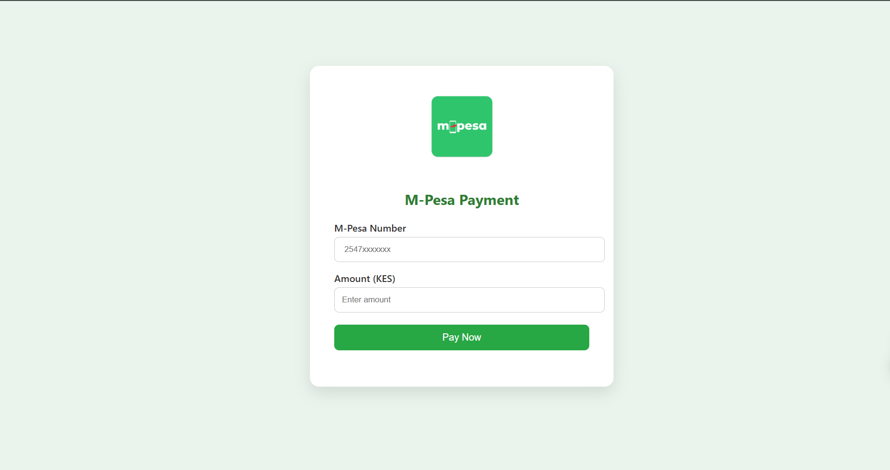

# 💸 M-Pesa STK Push Integration

A simple Node.js + Express application that integrates Safaricom’s M-Pesa STK Push API. Users can enter their phone number and payment amount through a frontend form and trigger a real-time payment prompt via M-Pesa.

---

## 📸 Preview

 <!-- Replace with your actual screenshot -->

---

## 🚀 Features

- Accepts phone numbers in `07xxxxxxxx` format
- Converts numbers to M-Pesa-compatible `2547xxxxxxxx` format
- Secure STK Push request using Safaricom sandbox
- Responsive and modern UI with M-Pesa branding
- Callback endpoint to receive M-Pesa payment status

---

## ⚙️ Setup Instructions (One Command Block)

```bash
# Clone the repository
git clone https://github.com/your-username/mpesa-stk-push.git
cd mpesa-stk-push

# Install dependencies
npm install

# Create .env file
cat > .env <<EOL
PORT=3000
CONSUMER_KEY=your_safaricom_consumer_key
CONSUMER_SECRET=your_safaricom_consumer_secret
SHORTCODE=174379
PASSKEY=your_safaricom_passkey
CALLBACK_URL=https://yourdomain.com/callback
EOL

# Start the server
npm start
